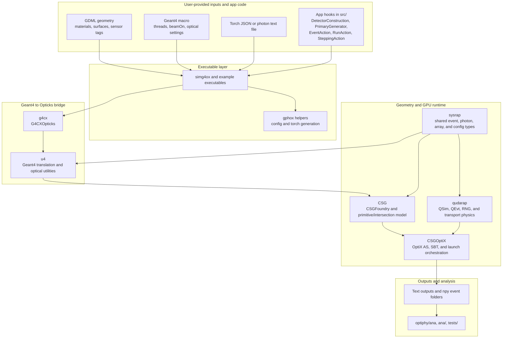
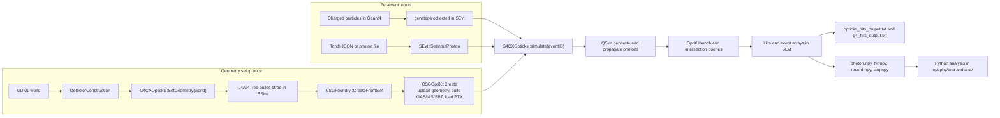
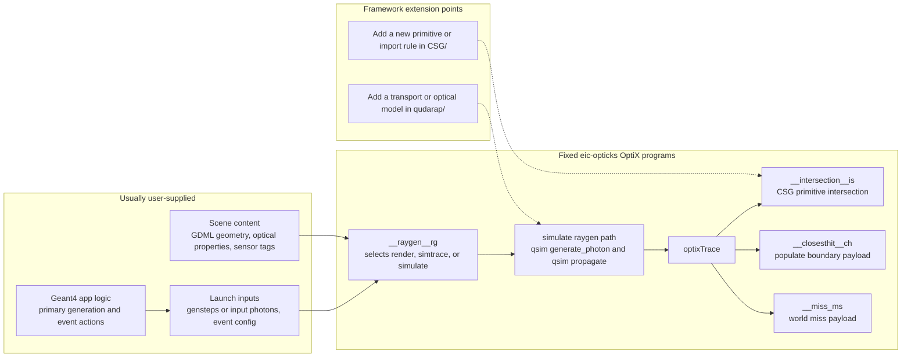

This simulation package interfaces NVIDIA OptiX with Geant4 to accelerate
optical photon transport for physics experiments. It supports detector
geometries defined in the GDML format and is based on the work by Simon Blyth,
whose original Opticks framework can be found
[here](https://simoncblyth.bitbucket.io/opticks/).


## Prerequisites

Before building or running this package, ensure that your system meets both the
hardware and software requirements listed below.

* A CUDA-capable NVIDIA GPU

* CUDA 12+
* NVIDIA OptiX 7+
* Geant4 11+
* CMake 3.18+
* Python 3.8+

OptiX releases have specific [minimum NVIDIA driver
requirements](https://developer.nvidia.com/designworks/optix/downloads/legacy):

| OptiX version | Release date  | Minimum driver required |
|---            |---:           |---                      |
| 9.0.0         | February 2025 | 570                     |
| 8.1.0         | October 2024  | 555                     |
| 8.0.0         | August 2023   | 535                     |
| 7.7.0         | March 2023    | 530.41                  |
| 7.6.0         | October 2022  | 522.25                  |
| 7.5.0         | June 2022     | 515.48                  |
| 7.4.0         | November 2021 | 495.89                  |
| 7.3.0         | April 2021    | 465.84                  |
| 7.2.0         | October 2020  | 455.28                  |
| 7.1.0         | June 2020     | 450                     |
| 7.0.0         | August 2019   | 435.80                  |

Optionally, if you plan to develop or run the simulation in a containerized
environment, ensure that your system has the following tools installed:

* [Docker Engine](https://docs.docker.com/engine/install/)
* NVIDIA container toolkit ([installation guide](https://docs.nvidia.com/datacenter/cloud-native/container-toolkit/latest/install-guide.html))

## Build

```shell
git clone https://github.com/BNLNPPS/eic-opticks.git
cmake -S eic-opticks -B build
cmake --build build
```

## Architecture overview

At a high level, `eic-opticks` uses Geant4 to define the detector and event context, translates that geometry into a CSG representation, and then uses NVIDIA OptiX plus CUDA to generate and propagate optical photons on the GPU. The main bridge is `G4CXOpticks`: `SetGeometry(world)` builds the Opticks-side geometry once, and `simulate(eventID, reset)` launches GPU transport for each event.

For most integrations, new code lives in `src/` and `config/`. The lower-level packages are mostly framework code unless you are extending geometry import, GPU transport, or OptiX kernels.

### Layered view



### Runtime data flow

There are two main runtime entry modes:

- **Charged-particle driven**: Geant4 produces Cerenkov and/or scintillation gensteps, and the GPU launch turns those gensteps into photons and propagates them.
- **Direct photon input**: the app injects photons into `SEvt` with `SetInputPhoton`, using either a torch JSON configuration or a user-provided photon file.



### OptiX pipeline and extension points

At the OptiX level, users normally provide scene content and launch inputs, while `eic-opticks` provides the fixed OptiX programs. In the current codebase, the main OptiX programs live in `CSGOptiX/CSGOptiX7.cu`.



### What users typically provide

| You provide | Where it enters | Purpose |
|---|---|---|
| GDML geometry with material and surface properties, plus `SensDet` tags when needed | `DetectorConstruction` -> `G4CXOpticks::SetGeometry` | Defines the world, optical media, and sensitive surfaces |
| Geant4 macro | Geant4 run manager | Controls threads, `/run/beamOn`, visualization, and whether G4 also tracks optical photons |
| Primary generator and Geant4 actions in `src/` | Example app headers and executables | Defines beam/source setup, event flow, when GPU simulation is launched, and how outputs are written |
| Torch JSON config in `config/` | `generate_photons` -> `SEvt::SetInputPhoton` | Direct optical photon injection without charged primaries |
| Photon text file | `GPUPhotonFileSource` -> `SEvt::SetInputPhoton` | Replay or externally generated photon distributions |

### Where to start in the tree

- Start in `src/` if you are adding a new executable, a new input mode, or custom Geant4 user actions.
- Move to `g4cx/` and `u4/` when changing Geant4 integration, geometry translation, materials, surfaces, or sensor identification.
- Move to `CSG/` when adding a new primitive, changing CSG import, or debugging geometry intersections.
- Move to `qudarap/` and `CSGOptiX/` only when extending GPU transport physics or the OptiX launch programs.
- Use `optiphy/ana/`, `ana/`, and `tests/` to inspect outputs and validate behavior.

The examples below map these layers to concrete executables and input modes.

## Docker

Build latest `eic-opticks` image by hand:

```shell
docker build -t ghcr.io/bnlnpps/eic-opticks:latest https://github.com/BNLNPPS/eic-opticks.git
```

Build and run for development:

```shell
docker build -t ghcr.io/bnlnpps/eic-opticks:develop --target=develop .
```

Example commands for interactive and non-interactive tests:

```shell
docker run --rm -it -v $HOME/.Xauthority:/root/.Xauthority -e DISPLAY=$DISPLAY --net=host ghcr.io/bnlnpps/eic-opticks:develop

docker run --rm -it -v $HOME:/esi -v $HOME/eic-opticks:/workspaces/eic-opticks -e DISPLAY=$DISPLAY -e HOME=/esi --net=host ghcr.io/bnlnpps/eic-opticks:develop

docker run ghcr.io/bnlnpps/eic-opticks bash -c 'simg4ox -g tests/geom/sphere_leak.gdml -m tests/run.mac -c sphere_leak'
```


## Singularity

```shell
singularity run --nv -B eic-opticks-prefix/:/opt/eic-opticks -B eic-opticks:/workspaces/eic-opticks docker://ghcr.io/bnlnpps/eic-opticks:develop
```


## Running a test job at NERSC (Perlmutter)

To submit a test run of `eic-opticks` on Perlmutter, use the following example. Make sure to update
any placeholder values as needed.

```
sbatch scripts/submit.sh
```

```
#!/bin/bash

#SBATCH -N 1                    # number of nodes
#SBATCH -C gpu                  # constraint: use GPU partition
#SBATCH -G 1                    # request 1 GPU
#SBATCH -q regular              # queue
#SBATCH -J eic-opticks          # job name
#SBATCH --mail-user=<USER_EMAIL>
#SBATCH --mail-type=ALL
#SBATCH -A m4402                # allocation account
#SBATCH -t 00:05:00             # time limit (hh:mm:ss)

# Path to your image on Perlmutter
IMAGE="docker:bnlnpps/eic-opticks:develop"
CMD='cd /src/eic-opticks && simg4ox -g $OPTICKS_HOME/tests/geom/sphere_leak.gdml -m $OPTICKS_HOME/tests/run.mac -c sphere_leak'

# Launch the container using Shifter
srun -n 1 -c 8 --cpu_bind=cores -G 1 --gpu-bind=single:1 shifter --image=$IMAGE /bin/bash -l -c "$CMD"
```


## Optical Surface Models in Geant4

In Geant4, optical surface properties such as **finish**, **model**, and **type** are defined using enums in the
`G4OpticalSurface` and `G4SurfaceProperty` header files:

- [`G4OpticalSurface.hh`](https://github.com/Geant4/geant4/blob/geant4-11.3-release/source/materials/include/G4OpticalSurface.hh#L52-L113)
- [`G4SurfaceProperty.hh`](https://github.com/Geant4/geant4/blob/geant4-11.3-release/source/materials/include/G4SurfaceProperty.hh#L58-L68)

These enums allow users to configure how optical photons interact with surfaces, controlling behaviors like reflection,
transmission, and absorption based on physical models and surface qualities. The string values corresponding to these
enums (e.g. `"ground"`, `"glisur"`, `"dielectric_dielectric"`) can also be used directly in **GDML** files when defining
`<opticalsurface>` elements for geometry. Geant4 will parse these attributes and apply the corresponding surface
behavior.

For a physics-motivated explanation of how Geant4 handles optical photon boundary interactions, refer to the [Geant4
Application Developer Guide — Boundary
Process](https://geant4-userdoc.web.cern.ch/UsersGuides/ForApplicationDeveloper/html/TrackingAndPhysics/physicsProcess.html#boundary-process).

```gdml
<gdml>
  ...
  <solids>
    <opticalsurface finish="ground" model="glisur" name="medium_surface" type="dielectric_dielectric" value="1">
      <property name="EFFICIENCY" ref="EFFICIENCY_DEF"/>
      <property name="REFLECTIVITY" ref="REFLECTIVITY_DEF"/>
    </opticalsurface>
  </solids>
  ...
</gdml>
```


## Examples

EIC-Opticks provides several examples demonstrating GPU-accelerated optical photon simulation:

| Example | Physics | Geometry | Use Case |
|---------|---------|----------|----------|
| `GPUCerenkov` | Cerenkov only | Simple nested boxes (raindrop) | Basic Cerenkov testing |
| `GPURaytrace` | Cerenkov + Scintillation | 8x8 CsI crystal + SiPM array | Realistic detector simulation |
| `GPUPhotonSource` | Optical photons (torch) | Any GDML | G4 + GPU side-by-side validation |
| `GPUPhotonSourceMinimal` | Optical photons (torch) | Any GDML | GPU-only test |
| `GPUPhotonFileSource` | Optical photons (text file) | Any GDML | GPU-only, user-defined photons from file |

### Example 1: GPUCerenkov (Cerenkov Only)

The `GPUCerenkov` example uses the **opticks_raindrop** geometry - a simple nested box configuration
designed for testing Cerenkov photon production and GPU raytracing:

```
Geometry: opticks_raindrop.gdml
├── VACUUM world (240×240×240 mm)
│   └── Lead box (220×220×220 mm)
│       └── Air box (200×200×200 mm)
│           └── Water box (100×100×100 mm) ← Cerenkov medium
```

When charged particles traverse the water volume above the Cerenkov threshold, optical photons
are generated and traced on the GPU. This is a minimal example for validating the eic-opticks pipeline.

```bash
# Run with raindrop geometry (Cerenkov only)
GPUCerenkov -g tests/geom/opticks_raindrop.gdml -m run.mac
```

**Source files:** `src/GPUCerenkov.cpp`, `src/GPUCerenkov.h`

### Example 2: GPURaytrace (Cerenkov + Scintillation)

The `GPURaytrace` example demonstrates a realistic detector configuration with both Cerenkov
and scintillation physics using the **8x8 SiPM array** geometry (not validated yet):

```
Geometry: 8x8SiPM_w_CSI_optial_grease.gdml
├── Air world (100×100×100 mm)
│   ├── 64 CsI crystal pixels (2×2×8 mm each) ← Scintillation + Cerenkov
│   ├── Optical grease layer (17.4×17.4×0.1 mm)
│   ├── Entrance window (17.4×17.4×0.1 mm)
│   └── 64 SiPM active areas (2×2×0.2 mm each) ← Photon detectors
```

This geometry models a pixelated scintillator calorimeter with:
- **CsI(Tl) crystals**: Produce both Cerenkov and scintillation photons
- **Optical coupling**: Grease and window layers for photon transmission
- **SiPM readout**: 8×8 array of silicon photomultipliers with dead space modeling

```bash
# Run with 8x8 SiPM array geometry (Cerenkov + Scintillation)
GPURaytrace -g tests/geom/8x8SiPM_w_CSI_optial_grease.gdml -m tests/run.mac

# Check output for Cerenkov (ID=0) and scintillation (ID=1) photons
grep -c "CreationProcessID=0" opticks_hits_output.txt  # Cerenkov
grep -c "CreationProcessID=1" opticks_hits_output.txt  # Scintillation
```

**Source files:** `src/GPURaytrace.cpp`, `src/GPURaytrace.h`

### Example 3: GPUPhotonSource (G4 + GPU Validation)

`GPUPhotonSource` generates optical photons from a configurable torch source and runs
both Geant4 and eic-opticks GPU simulation in parallel on the same input photons. This
enables direct comparison of hit counts and positions between the two engines.

Both engines detect photons using the same mechanism: border surface physics. On the G4
side the `SteppingAction` records a hit when `G4OpBoundaryProcess` reports Detection at
the optical surface, matching how eic-opticks detects photons on the GPU.

| Argument | Description | Default |
|----------|-------------|---------|
| `-g, --gdml` | Path to GDML file | `geom.gdml` |
| `-c, --config` | Config file name (without `.json`) | `dev` |
| `-m, --macro` | Path to G4 macro | `run.mac` |
| `-i, --interactive` | Open interactive viewer | off |
| `-s, --seed` | Fixed random seed | time-based |

```bash
GPUPhotonSource -g tests/geom/opticks_raindrop.gdml -c dev -m run.mac -s 42
```

**Output:**
- `opticks_hits_output.txt` — eic-opticks GPU hits, one line per hit
- `g4_hits_output.txt` — Geant4 hits in the same format

Hit format (both files): `time wavelength (pos_x, pos_y, pos_z) (mom_x, mom_y, mom_z) (pol_x, pol_y, pol_z)`

**Source files:** `src/GPUPhotonSource.cpp`, `src/GPUPhotonSource.h`

### Example 4: GPUPhotonSourceMinimal (GPU-Only)

`GPUPhotonSourceMinimal` is a stripped-down version of `GPUPhotonSource` that runs
**only** eic-opticks GPU simulation. All G4 optical photon tracking infrastructure
(sensitive detectors, stepping actions, tracking actions) is removed. Geant4 is used
solely for geometry loading and hosting the event loop.

Use this when you only need GPU results and want faster execution.

| Argument | Description | Default |
|----------|-------------|---------|
| `-g, --gdml` | Path to GDML file | `geom.gdml` |
| `-c, --config` | Config file name (without `.json`) | `dev` |
| `-m, --macro` | Path to G4 macro | `run.mac` |
| `-i, --interactive` | Open interactive viewer | off |
| `-s, --seed` | Fixed random seed | time-based |

```bash
GPUPhotonSourceMinimal -g tests/geom/opticks_raindrop.gdml -c dev -m run.mac -s 42
```

**Output:** `opticks_hits_output.txt` — one hit per line

**Source files:** `src/GPUPhotonSourceMinimal.cpp`, `src/GPUPhotonSourceMinimal.h`

### Example 5: GPUPhotonFileSource (File Input, GPU-Only)

`GPUPhotonFileSource` reads optical photons from a plain text file and runs
GPU-only simulation via eic-opticks. Each line in the input file defines one
photon with 11 space-separated values:

```
# pos_x pos_y pos_z time mom_x mom_y mom_z pol_x pol_y pol_z wavelength
-10.0 -30.0 -90.0  0.0  0.0 0.287348 0.957826  1.0 0.0 0.0  420.0
-10.0 -30.0 -90.0  0.0  0.0 0.287348 0.957826  1.0 0.0 0.0  450.0
```

- Positions are in mm, time in ns, wavelength in nm
- Momentum direction should be normalized
- Polarization should be transverse to momentum and normalized
- Lines starting with `#` are comments and blank lines are skipped

| Argument | Description | Default |
|----------|-------------|---------|
| `-g, --gdml` | Path to GDML file | `geom.gdml` |
| `-p, --photons` | Path to input photon text file | (required) |
| `-m, --macro` | Path to G4 macro | `run.mac` |
| `-i, --interactive` | Open interactive viewer | off |
| `-s, --seed` | Fixed random seed | time-based |

```bash
GPUPhotonFileSource -g tests/geom/opticks_raindrop.gdml -p my_photons.txt -m run.mac
```

**Output:** `opticks_hits_output.txt` — one hit per line

**Source files:** `src/GPUPhotonFileSource.cpp`, `src/GPUPhotonFileSource.h`

### Torch configuration

`GPUPhotonSource` and `GPUPhotonSourceMinimal` read photon source parameters from a
JSON config file (default `config/dev.json`). Key fields:

| Field | Description |
|-------|-------------|
| `type` | Source shape: `disc`, `sphere`, `point` |
| `radius` | Size of the source area (mm) |
| `pos` | Center position `[x, y, z]` (mm) |
| `mom` | Emission direction `[x, y, z]` (normalized automatically) |
| `numphoton` | Number of photons to generate |
| `wavelength` | Photon wavelength (nm) |

### Code Differences

| Feature | GPUCerenkov | GPURaytrace | GPUPhotonSource | GPUPhotonSourceMinimal | GPUPhotonFileSource |
|---------|-------------|-------------|-----------------|----------------------|---------------------|
| Cerenkov genstep collection | ✓ | ✓ | ✗ | ✗ | ✗ |
| Scintillation genstep collection | ✗ | ✓ | ✗ | ✗ | ✗ |
| Torch photon generation | ✗ | ✗ | ✓ | ✓ | ✗ |
| Photon input from text file | ✗ | ✗ | ✗ | ✗ | ✓ |
| G4 optical photon tracking | ✓ | ✓ | ✓ | ✗ | ✗ |
| GPU simulation (eic-opticks) | ✓ | ✓ | ✓ | ✓ | ✓ |
| Multi-threaded | ✓ | ✓ | ✗ | ✗ | ✗ |

`GPUCerenkov` and `GPURaytrace` collect gensteps from charged particle interactions and
pass them to eic-opticks for GPU photon generation and tracing. `GPUPhotonSource` and
`GPUPhotonSourceMinimal` instead generate photons directly from a torch configuration.
`GPUPhotonSource` runs both G4 and GPU tracking for validation, while
`GPUPhotonSourceMinimal` skips G4 tracking entirely for a lean simplistic code so showcase what is needed for GPU only.
`GPUPhotonFileSource` reads photons from a user-provided text file, enabling custom photon
distributions without code changes.


### GDML Scintillation Properties for Geant4 11.x + eic-opticks

For scintillation to work with both Geant4 11.x and eic-opticks GPU simulation, the GDML
must define properties using the correct syntax:

1. **Const properties** (yield, time constants) must use `coldim="1"` matrices:
```xml
<define>
    <matrix coldim="1" name="SCINT_YIELD" values="5000.0"/>
    <matrix coldim="1" name="FAST_TIME_CONST" values="21.5"/>
</define>
```

2. **Both old and new style property names** are required for eic-opticks compatibility:
```xml
<material name="Crystal">
    <!-- New Geant4 11.x names -->
    <property name="SCINTILLATIONYIELD" ref="SCINT_YIELD"/>
    <property name="SCINTILLATIONCOMPONENT1" ref="SCINT_SPECTRUM"/>
    <property name="SCINTILLATIONTIMECONSTANT1" ref="FAST_TIME_CONST"/>
    <!-- Old-style names for Opticks U4Scint -->
    <property name="FASTCOMPONENT" ref="SCINT_SPECTRUM"/>
    <property name="SLOWCOMPONENT" ref="SCINT_SPECTRUM"/>
    <property name="REEMISSIONPROB" ref="REEMISSION_PROB"/>
</material>
```

See `tests/geom/8x8SiPM_w_CSI_optial_grease.gdml` for a complete working example.

## User/developer defined inputs

### Defining primary particles

There are certain user defined inputs that the user/developer has to define. In
the ```src/GPUCerenkov``` example that imports ```src/GPUCerenkov.h``` we provide
a working example with a simple geometry. The User/developer has to change the
following details: **Number of primary particles** to simulate in a macro file
and the **number of G4 threads**. For example:

```
/run/numberOfThreads {threads}
/run/verbose 1
/process/optical/cerenkov/setStackPhotons {flag}
/run/initialize
/run/beamOn 500
```

Here setStackPhotons defines **whether G4 will propagate optical photons or
not**. In production eic-opticks (GPU) takes care of the optical photon propagation.
Additionally the user has to define the **starting position**, **momentum** etc
of the primary particles define in the **GeneratePrimaries** function in
```src/GPUCerenkov.h```. The hits of the optical photons are returned in the
**EndOfRunAction** function. If more photons are simulated than can fit in the
GPU RAM the execution of a GPU call should be moved to **EndOfEventAction**
together with retriving the hits.

### Loading in geometry into EIC-Opticks

EIC-Opticks can import geometries with GDML format automatically. There are
about 10 primitives supported now, eg. G4Box. G4Trd or G4Trap are not supported
yet, we are working on them. ```GPUCerenkov``` takes GDML files through
arguments, eg. ```GPUCerenkov -g mygdml.gdml```.

The GDML must define all optical properties of surfaces of materials including:
- Efficiency (used by EIC-Opticks to specify detection efficiency and assign
  sensitive surfaces)
- Refractive index
- Group velocity
- Reflectivity
- Etc.


## Performance studies

In order to quantify the speed-up achieved by EIC-Opticks compared to G4 we
provide a python code that runs the same G4 simulation with and without tracking
optical photons in G4. The difference of the runs will yield the time required
to simulate photons. Meanwhile the same photons are simulated on GPU with
EIC-Opticks and the simulation time is saved.

```
mkdir -p /tmp/out/dev
mkdir -p /tmp/out/rel

docker build -t eic-opticks:perf-dev --target=develop
docker run --rm -t -v /tmp/out:/tmp/out eic-opticks:perf-dev run-performance -o /tmp/out/dev

docker build -t eic-opticks:perf-rel --target=release
docker run --rm -t -v /tmp/out:/tmp/out eic-opticks:perf-rel run-performance -o /tmp/out/rel
```

### Debug Analysis with `optiphy/ana/photon_history_summary.py`

The script analyzes GPU optical photon simulation output to debug where photons
went and why: which were detected, absorbed, scattered, or trapped bouncing
forever, and whether the physics (wavelength shifting, energy conservation)
worked correctly. Without it, the simulation is a black box that only reports
a hit count.

#### Prerequisites

The simulation must be run with `OPTICKS_EVENT_MODE` set so that output arrays
are saved to disk. The default mode (`Minimal`) only gathers hits into memory
and does **not** write `.npy` files.

```bash
export OPTICKS_EVENT_MODE=HitPhoton   # saves photon, hit, inphoton, record, seq
```

Valid modes for this script: `HitPhoton`, `DebugLite`, `DebugHeavy`.

#### Running a simulation with output saving

```bash
OPTICKS_EVENT_MODE=HitPhoton GPUPhotonSourceMinimal -g tests/geom/wls_test.gdml -c wls_test -m tests/run.mac -s 42
```

#### Output file location

Opticks writes `.npy` arrays to:

```
$TMP/GEOM/$GEOM/<ExecutableName>/ALL0_no_opticks_event_name/A000/
```

| Variable | Default | Override |
|----------|---------|---------|
| `$TMP` | `/tmp/$USER/opticks` | `export TMP=/path/to/tmp` |
| `$GEOM` | `GEOM` | `export GEOM=mygeom` |

For example, with defaults:

```
/tmp/$USER/opticks/GEOM/GEOM/GPUPhotonSourceMinimal/ALL0_no_opticks_event_name/A000/
├── photon.npy      # (N, 4, 4) float32 — final state of all photons
├── hit.npy         # (H, 4, 4) float32 — detected photons only
├── inphoton.npy    # (N, 4, 4) float32 — input photons before simulation
├── record.npy      # (N, 32, 4, 4) float32 — step-by-step history (up to 32 steps)
├── seq.npy         # (N, 2, 2) uint64 — compressed step sequence per photon
├── genstep.npy     # generation step parameters
└── domain.npy      # domain compression parameters
```

#### Running the analysis

```bash
# Basic summary tables:
python optiphy/ana/photon_history_summary.py <event_folder>

# Auto-resolves A000 subfolder:
python optiphy/ana/photon_history_summary.py /tmp/$USER/opticks/GEOM/GEOM/GPUPhotonSourceMinimal/ALL0_no_opticks_event_name

# Show step-by-step trace for specific photons:
python optiphy/ana/photon_history_summary.py <path> --trace 0,227,235

# Show all non-detected (lost) photons with full traces:
python optiphy/ana/photon_history_summary.py <path> --lost

# Filter by terminal flag:
python optiphy/ana/photon_history_summary.py <path> --flag BULK_ABSORB

# Show per-photon detail for first 20 photons:
python optiphy/ana/photon_history_summary.py <path> --detail 20
```

#### Output tables

The script prints six summary tables by default: photon outcomes by terminal
flag with hit rate and MaxBounce truncation count, cumulative flagmask history
distribution, wavelength statistics with energy conservation check, position/time
stats, ranked step sequence histories decoded from seq nibbles, and step count
distribution flagging truncated photons. The `--lost`, `--trace`, and `--flag`
options drill into specific photons with full step-by-step position, wavelength,
and flag traces for debugging exactly where and why a photon died.

| Table | Description |
|-------|-------------|
| **Photon Outcomes** | Counts by terminal flag (SURFACE_DETECT, BULK_ABSORB, etc.) with boundary indices, hitmask, and MaxBounce truncation count |
| **Photon Histories** | Unique cumulative flagmask combinations (e.g. TO\|RE\|BT\|SD) |
| **Wavelength Analysis** | Input vs output wavelengths, shift count, energy conservation check |
| **Position / Time** | Radius and time statistics |
| **Sequence Histories** | Top N step-by-step sequences from seq.npy (e.g. "TO RE BT SD") |
| **Step Counts** | Distribution of steps per photon, flags truncated ones at max |

#### Photon data layout (`sphoton.h`)

Each photon is a `(4, 4)` float32 matrix — four quads of four floats.
`photon.npy` holds the final state, `hit.npy` the detected subset,
`inphoton.npy` the initial state, and `record.npy` stores the full
step-by-step history (up to 32 bounces per photon, same quad layout per step).

| Quad | .x | .y | .z | .w |
|------|-----|-----|-----|-----|
| q0 | pos.x | pos.y | pos.z | time |
| q1 | mom.x | mom.y | mom.z | iindex |
| q2 | pol.x | pol.y | pol.z | wavelength (nm) |
| q3 | orient\_boundary\_flag | identity | index | flagmask |

#### q3 bit packing

q3 is stored as float32 but interpreted as uint32 via `.view(np.uint32)`.
This is where the physics outcome lives:

**q3.x** (`orient_boundary_flag`) packs three fields into 32 bits:

```
bit 31          : orient sign (1 = inward-facing surface normal)
bits 30-16      : boundary index (which pair of materials the photon is at)
bits 15-0       : terminal flag (what happened last)
```

Python extraction:
```python
q3    = photon[:, 3, :].view(np.uint32)
flag  = q3[:, 0] & 0xFFFF             # terminal flag
bnd   = (q3[:, 0] >> 16) & 0x7FFF     # boundary index
```

**q3.w** (`flagmask`) is the cumulative OR of every flag set during the
photon's lifetime. Each call to `set_flag(f)` does both
`flag = f` (replace) and `flagmask |= f` (accumulate). So a single integer
tells you the full history — e.g. `0x0854` = `TO|RE|SD|BT` means torch
generation, WLS re-emission, boundary transmit, surface detect.

#### Sequence history encoding (`sseq.h`)

`seq.npy` shape is `(N, 2, 2)` uint64. Each photon gets two pairs of uint64:
`seqhis[2]` (flag history) and `seqbnd[2]` (boundary history).

Each uint64 holds 16 slots of 4-bit nibbles (total 32 slots across the pair).
Flag nibbles store the **find-first-set** (FFS) of the flag bit:
TORCH (bit 2) stores as nibble 3, SURFACE_DETECT (bit 6) stores as 7.

```python
seqhis = seq[:, 0, :]   # two uint64 per photon
nibble = (seqhis[0] >> (4 * slot)) & 0xF   # for slot 0-15
flag   = 1 << (nibble - 1)                  # reconstruct flag
```

This gives a compact chronological per-step history in 16 bytes per photon.

#### Hit determination and MaxBounce

A photon is a "hit" when `(flagmask & hitmask) == hitmask`. The default
hitmask is `SD` (SURFACE_DETECT = 0x40), but for PMT efficiency tagging it may be
`EC` (EFFICIENCY_COLLECT = 0x2000). The script reads the actual hitmask from
`NPFold_meta.txt` in the event folder.

Photons that exhaust the bounce limit (`MaxBounce`, default 31, giving 32
steps) receive **no special flag** — the propagation loop simply exits and the
photon keeps whatever terminal flag it had at its last step. These are typically
photons trapped by total internal reflection. The script detects them by
checking `step_count == max_steps` and reports the count in the outcome table.

#### Flag definitions (`OpticksPhoton.h`)

Flags are a power-of-two enum where each GPU physics process gets one bit:

| Flag | Hex | Abbrev | Description |
|------|-----|--------|-------------|
| CERENKOV | 0x0001 | CK | Cerenkov generation |
| SCINTILLATION | 0x0002 | SI | Scintillation generation |
| TORCH | 0x0004 | TO | Torch (flashlight) source |
| BULK_ABSORB | 0x0008 | AB | Absorbed in bulk material |
| BULK_REEMIT | 0x0010 | RE | Re-emitted (scintillation or WLS) |
| BULK_SCATTER | 0x0020 | SC | Rayleigh scattered |
| SURFACE_DETECT | 0x0040 | SD | Detected at surface |
| SURFACE_ABSORB | 0x0080 | SA | Absorbed at surface |
| SURFACE_DREFLECT | 0x0100 | DR | Diffuse reflection at surface |
| SURFACE_SREFLECT | 0x0200 | SR | Specular reflection at surface |
| BOUNDARY_REFLECT | 0x0400 | BR | Fresnel reflection at boundary |
| BOUNDARY_TRANSMIT | 0x0800 | BT | Transmitted through boundary |
| NAN_ABORT | 0x1000 | NA | Aborted due to NaN (geometry error) |
| EFFICIENCY_COLLECT | 0x2000 | EC | Collected by PMT efficiency |
| EFFICIENCY_CULL | 0x4000 | EL | Culled by PMT efficiency |
| MISS | 0x8000 | MI | Missed all geometry |
