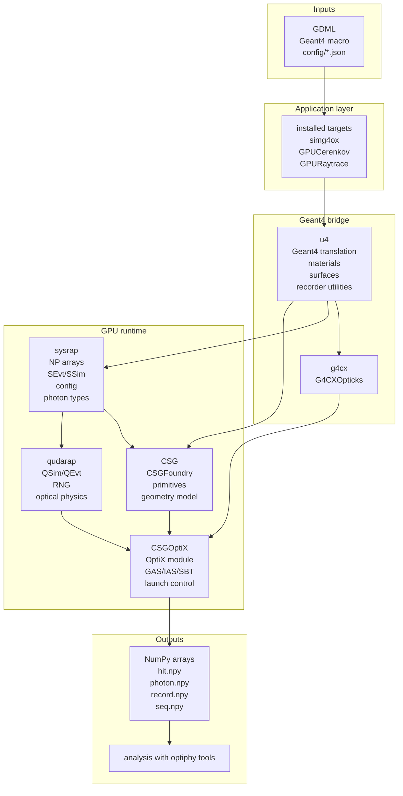
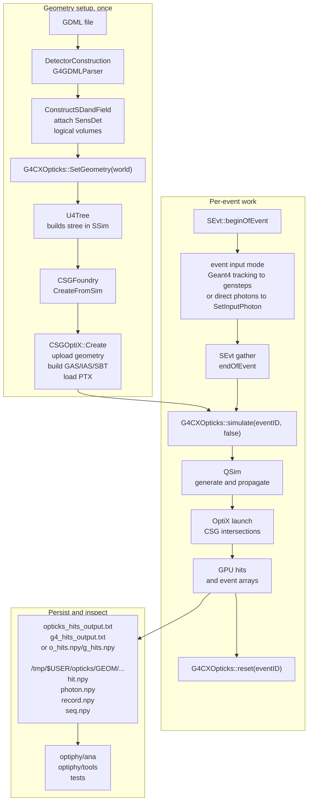
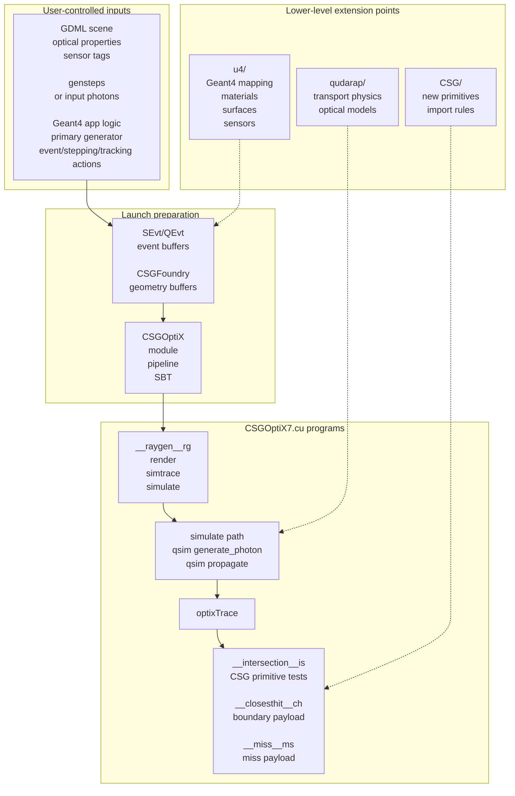

## Architecture overview

Simphony is a Geant4 plus OptiX optical photon transport stack. Geant4 owns the
detector construction, material definitions, event loop, and optional reference
tracking. `G4CXOpticks` is the bridge into the GPU stack: `SetGeometry(world)`
translates a Geant4 world into Opticks/CSG data once, and `simulate(eventID,
reset)` launches GPU photon generation and propagation for each event.

Application-facing code lives mainly in `src/`, `config/`, `tests/`, and
`optiphy/`. The lower-level packages are Opticks-derived framework libraries:
`sysrap`, `CSG`, `qudarap`, `CSGOptiX`, `u4`, and `g4cx`. Optional DD4hep
integration plugins live in `dd4hepplugins/` and are built only when DD4hep is
available.

### Layered view

### Build targets and packages

The top-level CMake project is `simphony` and builds these core libraries in
dependency order:

| Layer | CMake target | Directory | Main role |
|---|---|---|---|
| System utilities | `SysRap` | `sysrap/` | `NP`/`NPFold`, `SEvt`, `SSim`, logging, config, photon and genstep types |
| CSG geometry | `CSG` | `CSG/` | `CSGFoundry` and CSG primitive/intersection data |
| CUDA simulation support | `QUDARap` | `qudarap/` | `QSim`, `QEvt`, RNG, and optical physics tables |
| OptiX runtime | `CSGOptiX` | `CSGOptiX/` | OptiX PTX/module setup, acceleration structures, SBT, and launches |
| Geant4 utilities | `U4` | `u4/` | Geant4 material/surface/geometry translation and recorder support |
| G4-to-GPU bridge | `G4CX` | `g4cx/` | `G4CXOpticks` geometry setup, GPU simulation, and reset/finalization |

The installed application targets from `src/` are:

| Target | Purpose |
|---|---|
| `simg4ox` | General Geant4 application that loads GDML, reads a torch JSON config, runs Geant4, and launches GPU simulation at event end |
| `GPUCerenkov` | Cerenkov-focused example using charged-particle genstep collection |
| `GPURaytrace` | Cerenkov plus scintillation example with GPU ray tracing |
| `GPUPhotonSource` | Torch-generated optical photons, with Geant4 and GPU tracking side by side |
| `GPUPhotonSourceMinimal` | Torch-generated optical photons with GPU-only photon transport |
| `GPUPhotonFileSource` | User-provided photon text file with GPU-only photon transport |
| `consgeo` | GDML-to-CSG conversion helper |
| `simtox` | Torch photon generator that writes `out/photons.npy` |

`simphony_argparse` and `simphony_g4_deps` are interface targets used to share
third-party argparse headers and common Geant4/G4CX link dependencies. The
standalone `examples/` tree contains small consumer examples that use an
installed `simphony` package; it is not added by the top-level `CMakeLists.txt`.

### Runtime data flow

There are two main runtime input modes:

- **Charged-particle driven:** Geant4 tracks charged particles, Cerenkov and/or
  scintillation gensteps are collected into `SEvt`, and the GPU generates and
  propagates optical photons from those gensteps.
- **Direct photon input:** the application injects an `NP` array of photons into
  `SEvt` with `SetInputPhoton`, using photons generated from a torch JSON config
  or parsed from a user-provided photon file.

### OptiX pipeline and extension points

The fixed OptiX programs are built from `CSGOptiX/CSGOptiX7.cu` into a PTX
object during the CMake build and installed with the libraries. User code
usually changes scene content, photon/genstep inputs, or Geant4 actions rather
than editing the OptiX programs directly.

### What users typically provide

| You provide | Where it enters | Purpose |
|---|---|---|
| GDML geometry with material and surface properties, plus `SensDet` aux tags when needed | `DetectorConstruction` -> `G4CXOpticks::SetGeometry` | Defines the world, optical media, and sensitive surfaces |
| Geant4 macro | Geant4 run manager | Controls threads, `/run/beamOn`, visualization, and G4 optical-photon tracking settings |
| Geant4 user actions in `src/` | Executable-specific app headers | Defines primary generation, event flow, optional G4 reference tracking, and output writing |
| Torch JSON config in `config/` | `generate_photons` -> `SEvt::SetInputPhoton` | Direct optical photon injection without charged primaries |
| Photon text file | `GPUPhotonFileSource` -> `SEvt::SetInputPhoton` | Replay or externally generated photon distributions |
| DD4hep detector/application configuration, when enabled | `dd4hepplugins/` actions | Integrates Simphony GPU optical transport into DD4hep/DDG4 workflows |

### Where to start in the tree

- Start in `src/` if you are adding or changing an installed executable, input
  mode, Geant4 primary generator, or Geant4 action.
- Use `config/` for torch-source JSON presets and `tests/geom/` for GDML test
  geometries.
- Move to `g4cx/` and `u4/` when changing Geant4 integration, geometry
  translation, materials, surfaces, sensitive-detector mapping, or event
  recording.
- Move to `CSG/` when adding a CSG primitive, changing CSG import, or debugging
  geometry intersections.
- Move to `qudarap/` and `CSGOptiX/` only when extending GPU transport physics,
  event buffers, OptiX launches, or OptiX device programs.
- Use `dd4hepplugins/` for DD4hep/DDG4 action plugin work.
- Use `optiphy/ana/`, `optiphy/tools/`, and `tests/` to inspect outputs and
  validate behavior.
