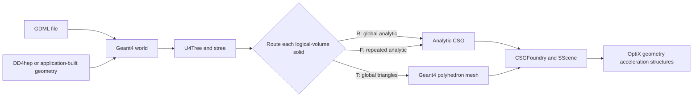

# Geometry guide

Simphony converts a Geant4 detector into geometry that NVIDIA OptiX can
intersect on the GPU. This guide shows how to try that conversion, explains
which shapes use exact analytic intersections or triangle meshes, and gives a
practical workflow for bringing in a detector of your own.

The most useful rule to remember is simple: keep optical boundaries analytic
when that is practical, and use triangles for shapes that are genuinely
faceted or are not available on the analytic path.

## Try a known geometry first

After building or installing Simphony, run the small raindrop example from the
repository root:

```shell
simg4ox \
    -g tests/geom/opticks_raindrop.gdml \
    -c dev \
    -m tests/run.mac \
    -s 42
```

The `-g` option selects the GDML detector, while `config/dev.json` defines 100
optical photons aimed through it. `simg4ox` gives the same initial photons to
Geant4 and to Simphony. This makes it a useful first check of both geometry
conversion and optical transport. Event and hit files are written under the
`event.output_dir` from the JSON configuration; see [Simulation inputs and
outputs](inputs-outputs.md#output-protocol) for their layouts.

To check that a GDML file converts and to save the converted geometry without
running an event, use `consgeo`:

```shell
consgeo -g detector.gdml -o geometry-output
```

For an input named `detector.gdml`, this creates:

```text
geometry-output/detector/
├── origin.gdml
└── CSGFoundry/
    ├── meshname.txt
    ├── SSim/
    │   ├── stree/
    │   └── scene/
    └── ... NumPy geometry arrays
```

`origin.gdml` is Geant4's re-export of the loaded world. `CSGFoundry` contains
the analytic CSG data, triangle scene, material and surface data, transforms,
and instance metadata. If no CUDA device is available, conversion and saving
still proceed; only creation of the in-memory OptiX geometry is skipped.

To inspect the converted analytic CSG geometry interactively with the same
OptiX intersection programs used for photon transport, run:

```bash
simrender -g detector.gdml
```

The viewer displays surface normals by default. Use the mouse to orbit, pan,
and zoom, or use the corresponding keyboard controls:

- Arrow keys orbit; Shift+arrow keys pan.
- PageUp/PageDown dolly forward/back; `+`/`-` zoom in/out.
- `W`/`S`, `A`/`D`, and `Q`/`E` move forward/back, left/right, and
  up/down. Hold Shift for faster movement.
- `1`/`2` select front/back, `3`/`4` left/right, and `5`/`6`
  top/bottom orthographic views. These are views from -Y/+Y, -X/+X, and
  +Z/-Z respectively, looking toward the selected geometry frame.
- `O` switches projection, `H` restores the launch camera, and `X` switches
  between normal and depth display.

A perspective view sends rays from one eye point so distant objects appear
smaller. This foreshortening provides useful depth cues and makes free camera
navigation feel natural. An orthographic view sends parallel rays, so apparent
size does not depend on distance. The axis-aligned orthographic presets are
therefore better for checking silhouettes, alignment, symmetry, and relative
dimensions without perspective distortion.

`simrender --controls` or F1 prints the complete key map. `simrender --help`
lists initial camera, frame, and resolution options. This is a geometric
intersection diagnostic: it does not apply material or optical-surface physics.

Configure with `-DSIMPHONY_BUILD_INTERACTIVE_RENDERER=OFF` when only the
headless simulation and rendering libraries are needed.

Use a new output directory for each conversion. The current writer does not
clear an existing `CSGFoundry` directory first, so reusing a directory can
leave files from an older conversion mixed with the new output.

## Accepted geometry inputs

The command-line examples and the integration API enter the same conversion
pipeline in different ways.

| Input | How it enters Simphony | When to use it |
|---|---|---|
| GDML file | `-g detector.gdml` on `simg4ox`, `GPURaytrace`, `GPUCerenkov`, and the other example applications | The simplest route for standalone studies |
| Live Geant4 world | `G4CXOpticks::SetGeometry(world)` with a `G4VPhysicalVolume*` | Embedding Simphony in a Geant4 application |
| DD4hep compact geometry | DD4hep builds the Geant4 world, then the Simphony DD4hep plugin passes that world into the same API | Experiments that already use DD4hep |
| Saved `CSGFoundry` | Lower-level `G4CXOpticks` workflows load it through the configured geometry base | Reusing a deliberately persisted conversion |

The standalone applications do not read DD4hep compact XML directly, and
their `-g` option does not load a saved `CSGFoundry`. It always means a GDML
file. See [`dd4hepplugins/examples`](../dd4hepplugins/examples) for working
DD4hep integrations.

## What conversion does

The conversion starts from a complete Geant4 world, not from a bare mesh. It
collects the volume hierarchy, placements, materials, optical surfaces, and
solids before it builds the GPU geometry.



The letters in the diagram are internal labels that are useful in diagnostic
output:

- `R` is the analytic, non-instanced remainder. It includes the world and
  other geometry that was not factored as a repeated subtree.
- `F` is an analytic repeated subtree. Simphony stores one copy of its shape
  and many placement transforms.
- `T` is the global triangle group. It contains all placements selected for
  triangle intersection.

There is currently no triangulated instance type. If a triangle-selected solid
occurs in a repeated subtree, that subtree is removed from analytic
factorization and every affected placement goes into `T`. The geometry remains
usable, but it can require substantially more host memory, GPU memory, and
acceleration-structure build time.

### Selection is by solid, not by placement

A logical volume points to one Geant4 solid, and Simphony chooses one GPU route
for that whole solid. All placements of the logical volume therefore follow
the same route. You cannot triangulate one placement while leaving another
placement of the same logical volume analytic.

The same rule applies inside a compound solid. If a Boolean or multi-union
contains a tessellated constituent, Simphony selects the enclosing
logical-volume solid for triangles. It does not mix analytic and triangle
intersection within that one compound solid.

### Every recognized solid gets a mesh

During conversion, `U4Mesh` asks Geant4 to create a `G4Polyhedron` for every
recognized solid and stores indexed vertices and triangles in the scene. The
route classification decides whether OptiX actually intersects that solid as
analytic CSG or as triangles.

For a direct `G4TessellatedSolid`, the polyhedron comes from its authored
facets. Quads are split into triangles. For curved primitives and compound
solids, the polyhedron is Geant4's polygonal approximation. The optical
simulation computes a face normal from the three vertices of the intersected
triangle, so facet size and winding can directly affect reflection and
refraction.

## Supported Geant4 solids

The following table describes the current conversion in `u4/U4Solid.h`. A
shape listed as analytic can still be deliberately sent to the triangle route
by name.

| Geant4 solid | Default GPU route | Current behavior |
|---|---|---|
| `G4Box`, `G4Orb` | Analytic | Direct box and sphere primitives |
| `G4Sphere` | Analytic | Supports radial shells, theta cuts, and partial-phi intervals |
| `G4Tubs` | Analytic | Supports hollow tubes and partial-phi intervals |
| `G4Ellipsoid` | Analytic | Represented by a scaled sphere; top and bottom z cuts are handled |
| `G4Cons` | Analytic | Full-phi cones and conical shells only; see the partial-phi warning below |
| `G4Polycone` | Analytic | Full-phi polycones are decomposed into analytic sections |
| `G4Trap`, `G4Trd` | Analytic | Converted to convex polyhedra from their eight vertices |
| `G4UnionSolid`, `G4IntersectionSolid`, `G4SubtractionSolid` | Analytic | Converted recursively when every constituent is supported |
| `G4MultiUnion` | Analytic or triangles | Primitive members can remain analytic; tessellated or internally unsupported content selects the enclosing solid for triangles |
| `G4Torus` | Triangles | Recognized and selected automatically because there is no active analytic torus intersection path |
| `G4CutTubs` | Triangles | Recognized and selected automatically; current conversion has the restriction noted below |
| `G4TessellatedSolid` | Triangles | Detected automatically, including inside Boolean, displaced, and multi-union solids |

`G4DisplacedSolid` is also handled as the transform wrapper used for a
constituent of a Boolean or multi-union. It is not an additional visible
volume.

### Limits that geometry authors need to know

- `G4Hype` and Geant4 solid types not recognized by `U4Solid` do not currently
  convert. Manual triangulation does not bypass this step, so adding the name
  to `stree__force_triangulate_solid` will not make an unknown type work.
- The current `G4Cons` conversion does not apply its start-phi or delta-phi
  parameters. Use only full-phi `G4Cons` solids; a partial-phi cone would
  otherwise become a full cone on the GPU.
- Partial-phi `G4Polycone` conversion stops by default. An experimental
  `U4Polycone__ENABLE_PHICUT=1` path exists, but it is not the recommended
  starting point for production geometry. Prefer a tested decomposition or a
  supported tessellated representation.
- `G4CutTubs` conversion currently expects both end-plane normals to have a
  zero local y component. The completed volume may still be placed and rotated
  normally, but an arbitrarily oriented cut in the solid's local frame will
  fail conversion.
- A Boolean expects the usual Geant4/GDML form in which any constituent
  displacement is on the second operand. A displaced first operand or nested
  `G4DisplacedSolid` wrappers are not supported by the current converter.

If a required solid falls outside these limits, first try to express it as a
small combination of supported primitives. Use a native tessellated solid when
the shape is truly faceted. A code change is required for a completely unknown
Geant4 solid because the converter still needs a placeholder, bounds, and
boundary metadata before the triangle scene can be built.

## Choosing analytic geometry or triangles

Analytic CSG is usually the best default for optical volumes. It keeps curved
surfaces exact, computes analytic normals, and allows large repeated detector
structures to be instanced efficiently.

Triangles are a good fit for:

- CAD-like parts that are intentionally faceted.
- Native GDML `<tessellated>` solids.
- Tori, cut tubes, and other recognized shapes that Simphony automatically
  routes away from analytic intersection.
- A small number of named solids for which the analytic conversion is known to
  be unsuitable.

Triangles are a less attractive fit for highly repeated photosensors or for
curved, optical-critical interfaces. Those cases lose triangle instancing and
introduce a resolution-dependent approximation.

### Native tessellated input

A GDML `<tessellated>` element becomes a `G4TessellatedSolid`, so no selection
environment variable is needed. Before using it for optical transport, check
that:

- The facets form a closed, watertight solid.
- Facet vertices have consistent outward winding.
- There are no zero-area or duplicate facets.
- The mesh resolution is fine enough at every optical boundary.
- Geant4 reports the expected volume and extent before Simphony conversion.

When a tessellated constituent is nested inside another solid, Geant4 creates
the polyhedron for the enclosing solid. The resulting triangles therefore
describe that complete Boolean or multi-union result, not only the nested
tessellated constituent.

The repository's native tessellation tests construct a closed tetrahedron at
runtime. There is not yet a GDML fixture that runs a native tessellated solid
through GPU optical intersection in CI. Treat a new native tessellated detector
as requiring its own end-to-end GPU validation.

## Selecting additional solids for triangles

Set `stree__force_triangulate_solid` before launching the application. Its
value is a comma-separated list of exact imported solid names:

```shell
export stree__force_triangulate_solid='SupportRing,ComplexEnvelope'
simg4ox -g detector.gdml -c detector -m run.mac -s 42
```

These are solid names, not logical-volume or physical-volume names. `U4Tree`
strips generated pointer-like `0x...` suffixes and adds `_0`, `_1`, and similar
suffixes when needed to make imported names unique. Stable, unique GDML solid
names avoid surprises.

For a large list, use one solid name per line in a file:

```text
# triangle-solids.txt
SupportRing
ComplexEnvelope
```

Then point the environment variable at an absolute path:

```shell
export stree__force_triangulate_solid='filepath:/data/my-detector/triangle-solids.txt'
```

Blank lines and lines beginning with `#` are ignored. To discover the exact
imported names, first save an analytic conversion and inspect
`CSGFoundry/meshname.txt`:

```shell
consgeo -g detector.gdml -o geometry-analytic
rg 'Support|Envelope' geometry-analytic/detector/CSGFoundry/meshname.txt
```

A requested name that is not found prints
`stree::FindForceTriangulateLVID name not found`; it does not stop the
application. Treat that warning as a configuration error. For a short
selection summary during conversion, enable the supported diagnostics:

```shell
SSim__stree_level=1 \
stree__findForceTriangulateLVID_DUMP=1 \
stree__force_triangulate_solid='SupportRing' \
consgeo -g detector.gdml -o geometry-triangles
```

Selection happens while the live Geant4 world is converted. The standalone
applications repeat this conversion each time they read GDML, so the variables
must be set before each launch. If you explicitly save and later load a
`CSGFoundry`, the selected logical-volume IDs and generated meshes are already
part of that saved geometry; changing the variables does not rewrite the
cache.

## Controlling mesh resolution

Geant4 uses a configurable number of rotation steps when it polygonizes curved
solids. Simphony can set this resolution for a Geant4 solid type, one exact raw
solid name, or a group of raw names that share a prefix:

```shell
# Apply to every torus.
export U4Mesh__NumberOfRotationSteps_entityType_G4Torus=48

# Apply to raw solid names that begin with SupportRing.
export U4Mesh__NumberOfRotationSteps_solidName_STARTING_pfx_0=SupportRing
export U4Mesh__NumberOfRotationSteps_solidName_STARTING_val_0=96
```

The prefix form is useful when a GDML reader or an embedding application keeps
a generated `0x...` suffix in the Geant4 solid name. Choose a prefix that is
long enough to identify only the intended solids. Up to three prefix and value
pairs can be defined with indices `0`, `1`, and `2`. The first matching prefix
is used.

Mesh resolution and forced triangulation use different forms of a solid name.
`U4Tree` removes a generated `0x...` suffix when it writes
`CSGFoundry/meshname.txt` and resolves `stree__force_triangulate_solid`.
`U4Mesh` uses the raw `G4VSolid::GetName()` instead. For example, a raw name of
`SupportRing0x123abc` appears as `SupportRing` in `meshname.txt`. An exact mesh
override ending in only `SupportRing` will not match the raw name. Include the
full suffix when targeting that one exact raw name:

```shell
export U4Mesh__NumberOfRotationSteps_solidName_SupportRing0x123abc=96
```

After a baseline conversion, inspect the raw names recorded in the mesh
metadata rather than copying normalized names from `meshname.txt`:

```shell
rg '^(solidName|numberOfRotationSteps):' \
    geometry-analytic/detector/CSGFoundry/SSim/stree/mesh/*/NPFold_meta.txt
```

The `solidName` field shows the raw name used for matching. After adding an
override and making a fresh conversion, confirm that the intended mesh also
records the requested `numberOfRotationSteps`. The field is absent when no
override matched.

When more than one setting matches, the exact raw name takes precedence. The
first matching prefix is next, followed by the entity type. Without a match,
Geant4 uses its default of 24 rotation steps. Only the triangle route uses the
polygonized surface for GPU intersections. Changing mesh resolution does not
alter an analytic intersection.

Treat a resolution change as a geometry change. Generate a fresh saved output,
record the setting with the study, and repeat the optical comparison. Curved
triangle geometry is ready only when the observables of interest are stable as
the rotation-step count increases.

## Designing the volume hierarchy

### Use clear, stable names

Give solids, logical volumes, and physical volumes different naming patterns so
logs and saved arrays are easy to interpret. A useful convention is:

```text
solid:            PMTWindowSolid
logical volume:   PMTWindowLV
physical volume:  PMTWindowPV_0042
```

The exact names are an experiment choice; the important part is that a solid
targeted for special handling keeps a stable, unique name between exports.

### Preserve real repetition

Build a repeated detector module as one logical-volume subtree placed many
times. Simphony finds repeated subtrees by their structural digest. By default,
a subtree must occur at least 500 times to become an analytic factor; the
conversion-time environment variable `stree__FREQ_CUT` controls that
threshold.

The factorizer keeps the largest qualifying repeated subtree and disqualifies
qualifying repeats contained inside it. This avoids nested instances. If any
solid in a candidate subtree is selected for triangles, the whole candidate is
also disqualified from analytic factorization.

Lowering `stree__FREQ_CUT` is an advanced performance choice, not a requirement
for correctness. Measure conversion time, GPU memory, and propagation time for
the complete detector before adopting a non-default value.

### Keep optical interfaces explicit

Each optical medium should be a distinct logical volume with the correct
material. Put windows, coupling layers, photocathodes, scintillators, and WLS
regions in separate volumes when their interfaces matter to the physics.

Avoid unintended overlaps, microscopic gaps, sliver volumes, and coincident
sibling faces. Simphony's command-line applications do not provide a dedicated
overlap-checking option, so run the geometry checks supplied by Geant4 or by the
geometry-authoring framework before GPU validation.

Simphony imports both logical border surfaces and logical skin surfaces.
Because a border surface is directional in Geant4, define both directions when
the reverse crossing needs an explicit surface. Material `RINDEX` tables and
surface-property tables must cover the energy range of the photons being
simulated. See [Physics](physics.md) for the exact GPU interpretation of
`model`, `finish`, `type`, `EFFICIENCY`, and `REFLECTIVITY`.

For `simg4ox` CPU/GPU hit comparisons, mark a detector logical volume with a
`SensDet` GDML auxiliary and give its optical surface an `EFFICIENCY` property.
The repository fixtures use this form:

```xml
<volume name="SensorLV">
  <materialref ref="SensorMaterial"/>
  <solidref ref="SensorSolid"/>
  <auxiliary auxtype="SensDet" auxvalue="PhotonDetector"/>
</volume>
```

The complete surface definition is shown in
[`tests/geom/opticks_raindrop.gdml`](../tests/geom/opticks_raindrop.gdml).

### Keep Boolean trees understandable

Booleans are supported, but deep trees with nearly coincident surfaces are
difficult to validate and can magnify numerical boundary problems. Prefer a
small number of well-named constituents and move optically irrelevant
mechanical detail into separate volumes. This also makes it possible to send a
complex support part to triangles without changing a nearby optical volume.

## Validate a new detector in stages

### 1. Check host-side conversion

Save a fresh conversion with `consgeo`. Investigate any unhandled-solid
message, assertion, missing solid name, or unexpected output extent before
running photons. A successful GDML parse alone is not enough: the complete
`U4Tree`, triangle scene, and `CSGFoundry` conversion must finish.

The two native tessellation unit tests do not require GPU intersection:

```shell
ctest --test-dir build \
    -R '^U4Test\.(TessellatedSolidTest|U4TreeTessellatedTest)$' \
    --output-on-failure
```

They check tessellated-solid dispatch, bounds, transformed placement,
recursive detection, and the handling of repeated placements.

### 2. Check a small optical source

Aim a small torch source through one known interface. Confirm that the source
position is inside the expected material, its direction reaches the detector,
and its wavelength lies inside every relevant material and surface table.

Use `simg4ox` to compare Geant4 and GPU hit counts and distributions. The two
engines start with the same photons, but their random decisions are not
expected to produce identical photon histories. Compare statistical results,
boundary-state populations, and spatial distributions rather than requiring a
photon-for-photon match.

### 3. Compare analytic and triangle routes

For a solid that supports both routes, hold the source and random seed fixed,
then run once analytically and once with name-based triangulation. The
repository provides two GPU regressions that demonstrate this method:

```shell
tests/test_triangulated.sh
tests/test_triangulated_multi.sh
```

The first compares a curved sphere using analytic and triangle intersections.
The second verifies that selecting either of two sphere solid names affects
only that solid. Both scripts require a built installation on `PATH` and an
NVIDIA GPU.

### 4. Perform a resolution study

For curved triangle geometry, repeat the comparison with increasing
`U4Mesh__NumberOfRotationSteps_*` values. Record hit efficiency, reflection and
transmission fractions, hit-position distributions, conversion time, and GPU
memory. Stop increasing the resolution only when the quantities relevant to
the study have converged.

### 5. Scale to the full detector

Only after the small source behaves correctly should you raise photon count and
load the full hierarchy. Recheck conversion time and memory whenever a
triangle-selected solid belongs to a repeated module.

## Troubleshooting geometry conversion

| Symptom | Likely cause | What to check |
|---|---|---|
| `UNHANDLED SOLID TYPE` or an assertion in `U4Solid` | The solid type or one of its constituents has no current conversion | Compare the geometry with the support table; forcing triangles cannot rescue an unknown type |
| `name not found [...]` | The forced-triangulation name does not match the normalized imported solid name | Generate a baseline with `consgeo` and copy the name from `CSGFoundry/meshname.txt` |
| Conversion or GPU setup becomes much larger after selecting one solid | The solid belongs to a repeated subtree that lost analytic factorization | Check the hierarchy and triangle only an isolated support volume when possible |
| Triangle results move as rotation steps change | The curved mesh is too coarse for the observable | Increase resolution and document a convergence study |
| Many `MISS` or `NAN_ABORT` terminal flags | Source placement, overlaps, ambiguous boundaries, or malformed geometry may be involved | Start with one interface, inspect records, and follow [Performance and debugging](performance-and-debugging.md) |
| Geant4 and GPU have very different hit counts | Geometry may differ, but source, material tables, surfaces, or sensitive-detector setup can also cause it | Confirm the source and wavelength first, then compare boundary states and surface definitions |

## Authoring checklist

Before using a geometry for a physics result, confirm that:

- The complete Geant4 world converts, not only the GDML parser stage.
- Every solid type and special parameter combination appears in the support
  table above.
- Important solids have stable, unique names.
- Optical media and interfaces are represented by clear volume boundaries.
- Material and surface tables cover the simulated photon energies.
- Border surfaces have the intended direction or directions.
- Sensitive detector volumes are configured for the chosen application.
- Geant4 or the authoring framework reports no unintended overlaps.
- Native tessellated solids are closed, consistently wound, and nondegenerate.
- Forced-triangulation names resolve without warnings.
- Mesh-resolution overrides match the intended raw solid name, stable prefix,
  or entity type.
- Curved triangle geometry passes a mesh-resolution study.
- Repeated triangle-selected volumes fit within the available host and GPU
  memory.
- Geant4 and GPU optical results agree statistically for representative
  sources.

For most detectors, a good first production design is analytic CSG for repeated
sensor modules and optical-critical curved interfaces, with triangles reserved
for isolated mechanical parts and genuinely faceted solids.
